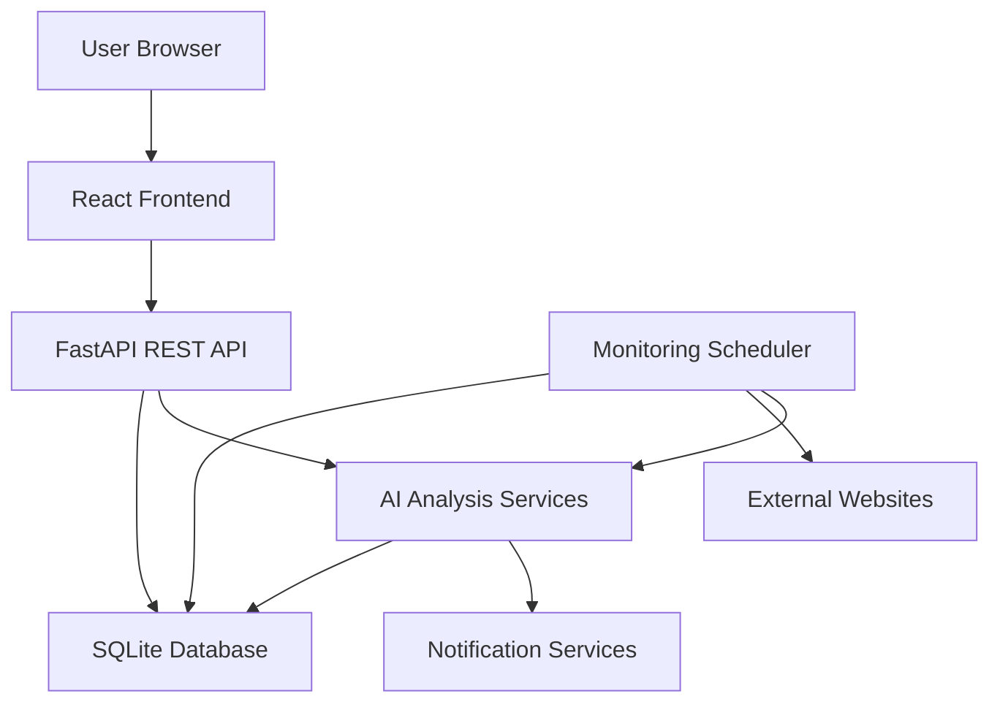
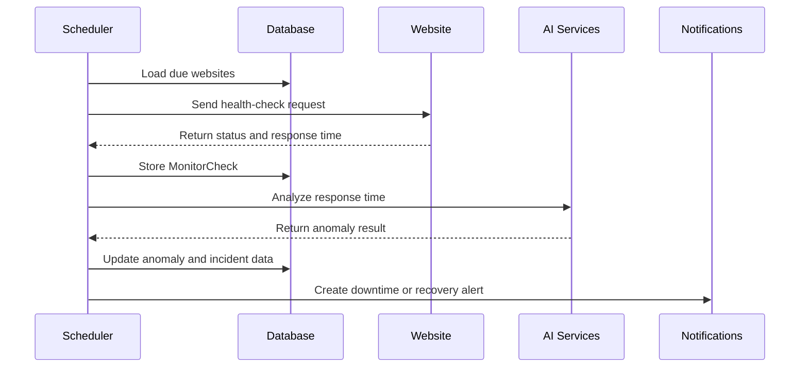
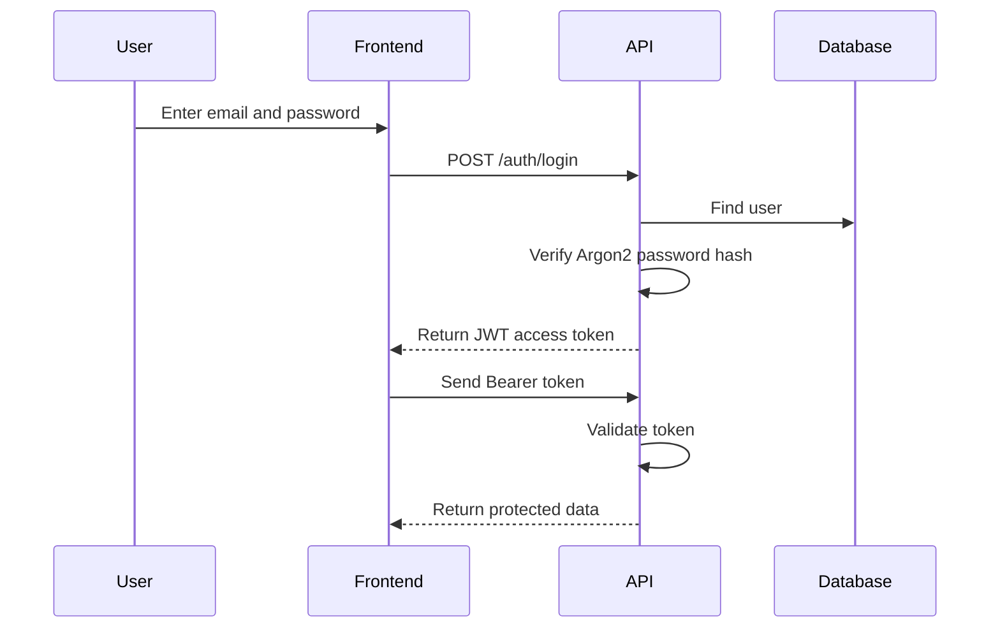
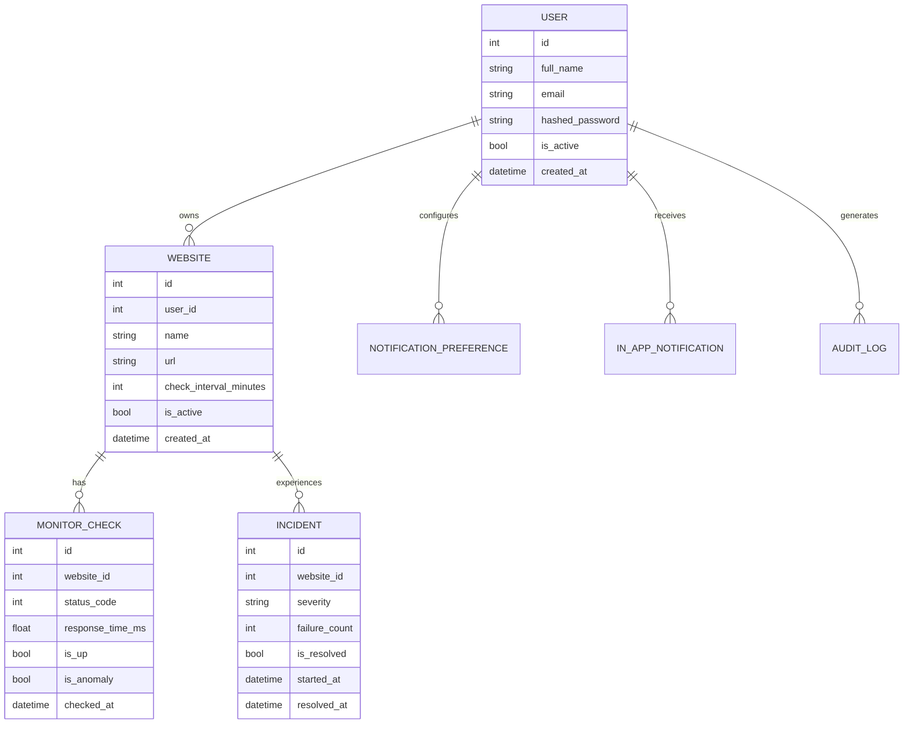

# SiteCare AI Architecture

## 1. Project Overview

SiteCare AI is an intelligent website health monitoring platform that monitors website availability, response time, incidents, anomalies, and future maintenance risk.

The system combines traditional website monitoring with machine-learning techniques to help users detect problems before they become serious failures.

## 2. Main Objectives

SiteCare AI is designed to:

- Monitor multiple websites automatically.
- Measure website availability and response time.
- Record historical monitoring results.
- Detect downtime and recovery events.
- Detect unusual response-time behaviour.
- Predict future maintenance risk.
- Send in-app and email notifications.
- Generate CSV and PDF monitoring reports.
- Provide a responsive operational dashboard.
- Protect each user’s monitoring data.

## 3. Technology Stack

### Backend

| Technology | Purpose |
|---|---|
| FastAPI | REST API framework |
| SQLAlchemy | Database ORM |
| Alembic | Database migrations |
| SQLite | Local development database |
| APScheduler | Automatic scheduled monitoring |
| Scikit-learn | Anomaly detection and prediction |
| PyJWT | Authentication tokens |
| pwdlib/Argon2 | Password hashing |
| ReportLab | PDF report generation |
| Pytest | Backend automated testing |
| Ruff | Python linting |

### Frontend

| Technology | Purpose |
|---|---|
| React | User-interface framework |
| TypeScript | Type-safe frontend development |
| Vite | Development and production build tool |
| React Router | Client-side routing |
| Recharts | Analytics charts |
| Lucide React | Interface icons |
| Vitest | Frontend automated testing |
| CSS | Responsive visual design |

## 4. High-Level Architecture



## 5. Major System Components

### React Frontend

The frontend provides the user interface for:

- Account registration and login
- Dashboard health overview
- Website management
- Manual health checks
- Incident history
- Anomaly analysis
- Maintenance predictions
- Analytics charts
- Notification management
- Profile and password management
- Account activity history
- CSV and PDF report downloads

The frontend communicates with the backend using JSON-based HTTP requests.

### FastAPI Backend

The backend is responsible for:

- Authenticating users
- Authorizing access to resources
- Validating request data
- Managing websites
- Performing health checks
- Calculating dashboard statistics
- Recording incidents
- Detecting anomalies
- Calculating maintenance predictions
- Creating notifications
- Generating reports
- Recording audit events

### Monitoring Scheduler

APScheduler runs periodically in the backend.

During every scheduler cycle, it:

1. Loads active websites.
2. Finds the most recent check for each website.
3. Calculates whether another check is due.
4. Sends an HTTP request to due websites.
5. Stores the monitoring result.
6. Detects performance anomalies.
7. Creates or resolves incidents.
8. creates monitoring notifications.

### Database

SQLite stores application data during local development.

The database structure is controlled through Alembic migrations so schema changes can be applied consistently.

### AI Services

SiteCare AI uses two analytical services:

- Isolation Forest anomaly detection
- Linear-regression maintenance prediction

These services operate on stored monitoring history.

## 6. Website Monitoring Workflow



## 7. Health-Check Processing

Each website check records:

- Website ID
- HTTP status code
- Response time in milliseconds
- Availability status
- Checked URL
- Error message
- Check timestamp
- Anomaly status
- Anomaly score
- Anomaly explanation

A website is considered operational when the HTTP request completes successfully with an acceptable response status.

A failed request can create or update an incident.

A successful request following a failure resolves the existing incident.

## 8. Incident Management

An incident represents a continuous website failure.

An incident stores:

- Affected website
- Severity
- Failure cause
- First HTTP status code
- Latest HTTP status code
- Consecutive failure count
- Start time
- Resolution time
- Incident duration
- Resolution status

Repeated failures update the existing open incident instead of creating duplicate incidents.

When the website recovers, the incident is marked as resolved and its duration is calculated.

## 9. Anomaly Detection

SiteCare AI uses the Isolation Forest algorithm to identify unusual response times.

### Training requirements

The detector requires at least 20 successful historical response-time measurements.

### Detection inputs

- Historical response-time values
- Current response-time value

### Detection methods

The service combines:

1. Isolation Forest model output
2. Statistical deviation from historical behaviour

This combined approach improves the detection of extreme values that may not always be identified by the machine-learning model alone.

### Detection output

The detector returns:

- Whether the measurement is anomalous
- Anomaly score
- Human-readable reason
- Number of training samples

## 10. Maintenance Prediction

SiteCare AI uses linear regression to estimate future response-time behaviour.

The maintenance model considers:

- Response-time trend
- Predicted future response time
- Failure rate
- Anomaly rate
- Current average response time
- Available sample count

The model produces:

- Risk score from 0 to 100
- Risk level
- Confidence percentage
- Future response-time prediction
- Maintenance recommendation

### Risk levels

| Score | Risk level |
|---:|---|
| 0–29 | Low |
| 30–59 | Medium |
| 60–79 | High |
| 80–100 | Critical |

If there are fewer than 10 successful measurements, the prediction remains in the learning state.

## 11. Authentication and Authorization

SiteCare AI uses JWT bearer authentication.

### Authentication process



Passwords are never stored as plain text.

Each protected resource is filtered using the authenticated user’s ID.

Users cannot access another user’s:

- Websites
- Monitoring history
- Incidents
- Reports
- Notifications
- Settings
- Audit records

Expired or invalid tokens are removed by the frontend, and the user is returned to the login page.

## 12. Main Database Entities



## 13. API Structure

The backend uses the `/api/v1` prefix.

| API group | Purpose |
|---|---|
| `/health` | Liveness and readiness checks |
| `/auth` | Registration, login and current user |
| `/account` | Profile and password management |
| `/websites` | Website management |
| `/monitoring` | Manual checks, status and history |
| `/dashboard` | Summary and website metrics |
| `/incidents` | Incident history |
| `/anomalies` | Anomaly results |
| `/predictions` | Maintenance predictions |
| `/notifications` | Notification preferences and alerts |
| `/reports` | CSV and PDF reports |
| `/audit-logs` | Account activity history |

Interactive API documentation is available at:

```text
http://127.0.0.1:8000/docs
```

## 14. Health and Readiness Monitoring

SiteCare provides two health endpoints.

### Liveness

```text
GET /api/v1/health
```

Confirms that the API process is running.

### Readiness

```text
GET /api/v1/health/ready
```

Confirms that:

- The API is responding.
- The database is connected.
- The monitoring scheduler is running or intentionally disabled.

The frontend displays this information in the application sidebar.

## 15. Notifications

SiteCare supports:

- Website downtime alerts
- Website recovery alerts
- Response-time anomaly alerts
- In-app notifications
- Email notification preferences

Email delivery requires valid SMTP configuration.

If SMTP is not configured, the monitoring system continues operating and in-app notifications remain available.

## 16. Reports

Users can download website monitoring reports in:

- CSV format
- PDF format

Reports are generated only for websites belonging to the authenticated user.

## 17. Security Controls

The project includes:

- Argon2 password hashing
- JWT authentication
- User-level resource ownership
- Protected API routes
- Configurable CORS origins
- Environment-based secrets
- Security response headers
- Request identifiers
- Generic authentication errors
- Audit logging
- Input validation
- SQLAlchemy parameterized queries
- Ignored environment and database files

## 18. Testing Strategy

### Backend

Backend tests cover:

- Health endpoints
- Authentication
- Website management
- Monitoring
- Dashboard calculations
- Incident handling
- Anomaly detection
- Maintenance prediction
- Notifications
- Reports
- Scheduler behaviour
- Account management

### Frontend

Frontend tests cover:

- Authentication token storage
- API request behaviour
- Unauthorized-session handling

### Continuous Integration

GitHub Actions automatically runs:

- Alembic migration checks
- Ruff linting
- Backend tests
- Frontend linting
- Frontend tests
- Production frontend build

## 19. Project Directory Structure

```text
Sitecare/
├── .github/
│   ├── dependabot.yml
│   └── workflows/
│       └── ci.yml
├── backend/
│   ├── app/
│   │   ├── api/
│   │   ├── core/
│   │   ├── db/
│   │   ├── middleware/
│   │   ├── models/
│   │   ├── schemas/
│   │   └── services/
│   ├── migrations/
│   ├── scripts/
│   └── tests/
├── frontend/
│   ├── public/
│   └── src/
│       ├── components/
│       ├── context/
│       ├── pages/
│       ├── services/
│       └── types/
├── docs/
│   └── ARCHITECTURE.md
├── .gitignore
└── README.md
```

## 20. Current Limitations

The current college-project version has these limitations:

- SQLite is intended mainly for local and academic use.
- Monitoring runs inside the API process.
- Email delivery depends on external SMTP configuration.
- The prediction model uses historical response-time trends and is not a guarantee of future failure.
- Horizontal scaling would require a separate scheduler worker.
- Production deployment would benefit from PostgreSQL and centralized background jobs.

## 21. Future Improvements

Possible future improvements include:

- PostgreSQL production database
- Redis-backed task queue
- Separate monitoring worker service
- SSL certificate-expiration monitoring
- Domain-expiration monitoring
- DNS health monitoring
- Multi-channel alerts
- Team workspaces
- Role-based access control
- Public status pages
- WebSocket live updates
- Mobile application
- Advanced time-series forecasting